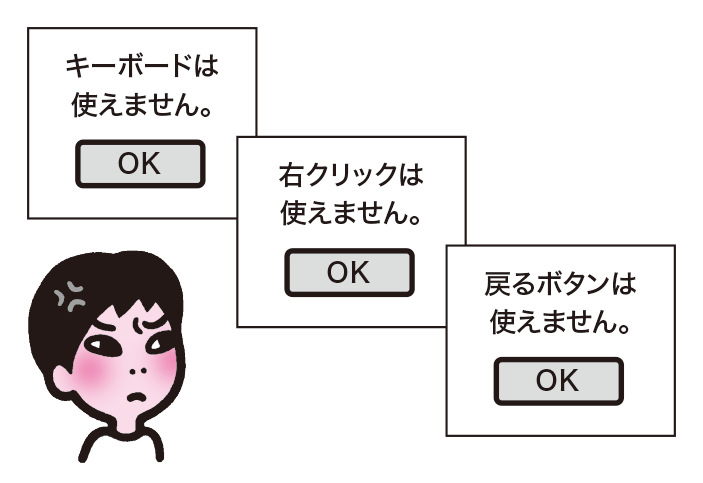
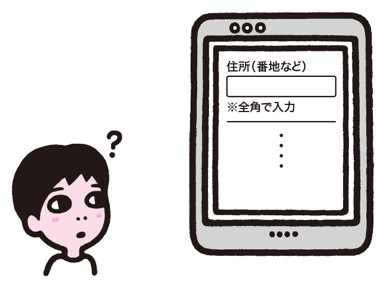
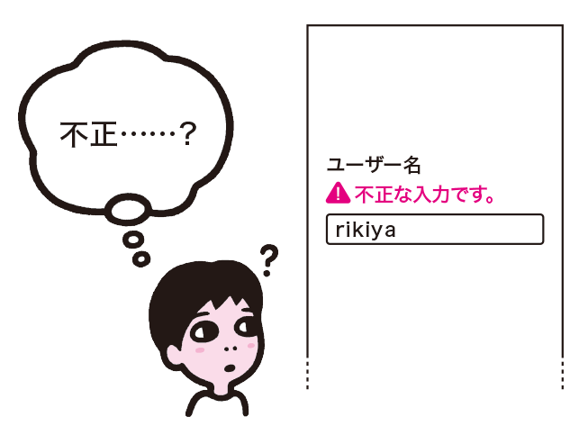
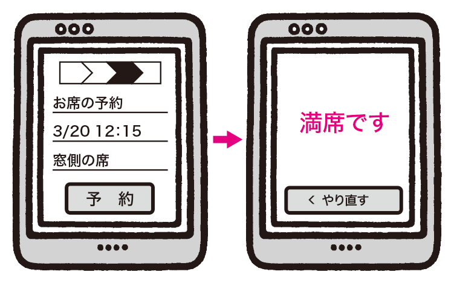
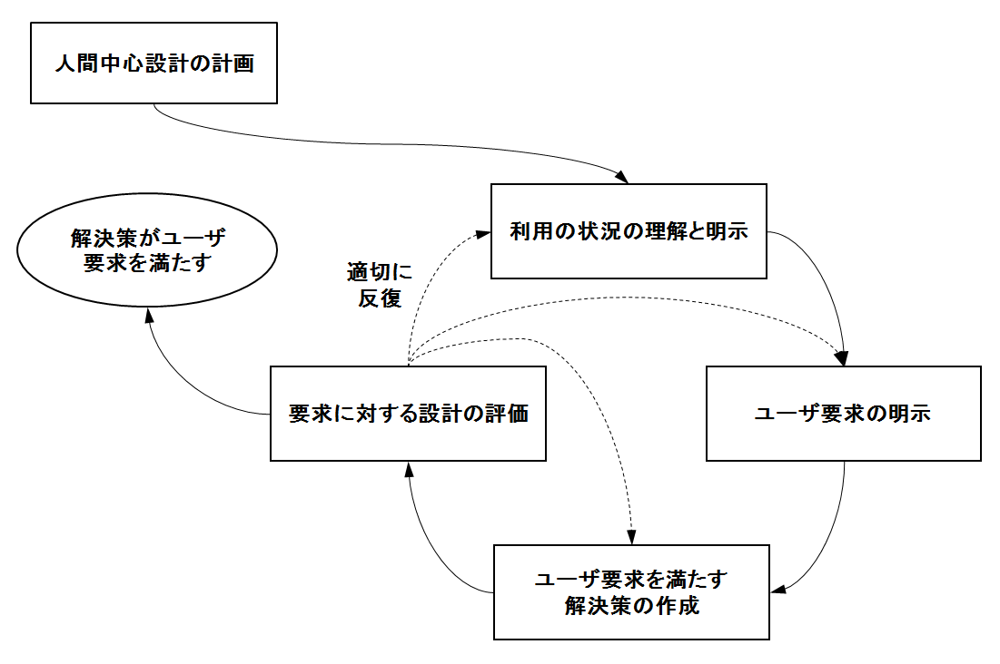
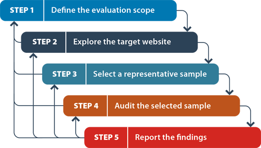
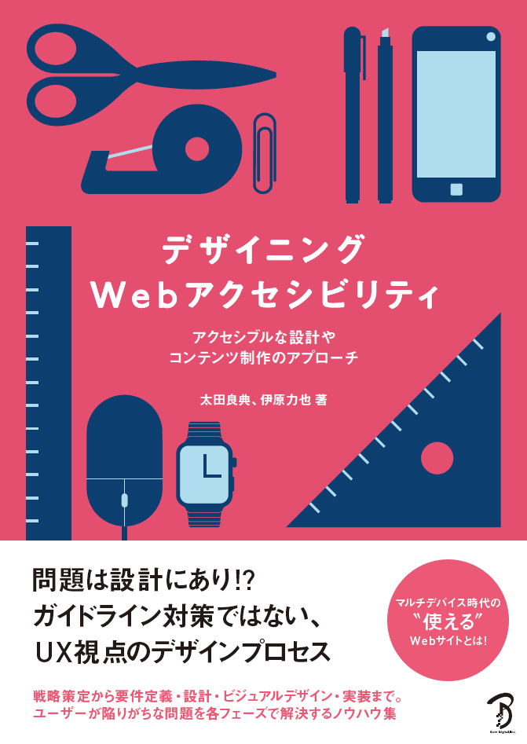

# アクセシビリティからはじめるHCD

## はじめに
ウェブユーザビリティが重要視されてからかなりの年月が経ちましたが、まだまだ低品質なユーザインタフェースを見かけることは多々あります。とはいえ、実ユーザーに向き合っていくHCDプロセスを現場に導入していくには、それなりに高いハードルがあることも事実です。

そこで私は、ウェブそのものが持つ「多様な状況で利用可能にせよ」という要求事項、つまりアクセシビリティからユーザーに向き合いはじめる、という手法に取り組んできました。この要求を満たすための経験則とパターンをまとめたガイドラインである「WCAG2.0」をHCDの各段階において用いることで、利用品質を確実に改善できるということを実務を通して感じています。

このアプローチは、設計者がユーザビリティやUXに目を向ける「きっかけづくり」としても優秀です。ガイドラインの内容が普遍的で自分ごとにしやすいからです。また、ユーザーの心理や特性ではなく、利用時の一時的な状況のパターンに着目したガイドラインであるため、実ユーザーに向き合っていく一般的なHCDプロセスとも矛盾なく同居できます。

ウェブの利用状況の多様化が急速に進む現在において、この考え方は当たり前のものとなっていくはずです。次の時代に備えるための第一歩として、プロジェクトでの実践や、書籍出版などの普及活動を通して学んできたことを、みなさまにご紹介します。

## まだまだ減らないウェブユーザビリティの課題
ウェブサイトにはユーザビリティが重要であるという考え方が示されてから、かなりの年月が経とうとしています。ヤコブ・ニールセンの「ウェブ・ユーザビリティ」の邦訳版の出版が2000年、スティーブ・クルーグの「ウェブユーザビリティの法則」が2001年ですから、約15年ほどが経過したわけです。

「ユーザビリティ」という言葉そのものは、少なくともウェブに関わる人たちのあいだでは一般化したように思います。言葉を聞いたことがない、という人はさすがにほとんどいないでしょう。しかし、いちユーザーとしてウェブサイトを利用していると、思わず頭に来てしまうような、使いにくいユーザインタフェースに出会うケースはまだまだたくさん存在しています。

キーボード、右クリック、戻るボタンの利用を禁止している［1］

全角で入力しないと怒られるフォーム［2］

理解できないエラーメッセージ［3］

全ての入力を受け付けつつ、最後に裏切ってくる［4］

このような例は決して珍しいものではなく、みなさんもウェブを利用するなかで、おそらく何度も遭遇したことがあるはずです。特にウェブサイトは、検索を入り口とした「課題解決の手段」としての一時的な利用となる場合が多く、ユーザー側の学習を期待しにくいため、より問題は顕在化しやすくなります。

［1］［2］［3］［4］太田良典, 伊原力也: デザイニングWebアクセシビリティ; ボーンデジタル (2015)

## システムの複雑さとユーザビリティ軽視の相関
機能要件を満たすという観点のみで画面設計を行い、ユーザビリティへの配慮がないまま実装に至り、リリースされてしまう。そんなケースはよくあります。

「チーム内で理解しやすいよう、ひとまず機能要件を画面に起こしてみた」そんなニュアンスで、割とカジュアルに最初の画面設計が行われることがよくあります。その時点ではユーザインタフェースの妥当性などはそれほど厳密に検討されておらず、その後のどこかの段階で再構成しようと考えているわけです。

しかし、その画面を元に具体的な工数見積もりを行ったり、開発リソースの準備などが進んでいくと、あとから画面構成に手を入れることに対する圧力が強まります。プロジェクト計画にインパクトを与えるし、使えないわけではないのだからいったんは問題ないだろう、となっていきます。

特に、複雑な入出力を伴うウェブアプリケーションや、多くの情報の入力が必要な電子申請システムといったものほど、プロジェクト進行上のチェックポイントが多く、「機能要件を満たしているか」という観点に視線が集まります。また、実装の期間も長く取らなければならないため、設計に使える期間が相対的に圧縮されていきます。

結果として、最初に起こした画面設計のまま、ユーザインタフェースを見直すチャンスは訪れず、ユーザビリティへの配慮は隅に追いやられたまま実装に突入してしまいます。そして、複雑なシステムほどユーザビリティも下がるという、負の相関が発現します。

もともと使うのが難しかったり大変だったりするものなのに、ユーザビリティが低く、たまにしか使わないから学習もままなりません。こういった状態だとユーザーはかなりのストレスを抱え、ついには利用自体を途中で放棄してしまったりします。しかし、なぜかこういうシステムに限って、必ず使わなければならないものだったりするのですよね。最終的にユーザーに残る体験は「最悪」の一言です。

## HCDはいきなり導入できるカルチャーなのか？
こういった状況の改善にHCDが効果的なのは、本誌をご覧いただいているみなさまには自明でしょう。しかし、その導入には、これもご承知のとおり、なかなか困難を伴うものです。HCDのプロセスは「調査、企画、設計、実装、評価」という一般的なウォーターフォール型の開発のプロセスと一見揃っているように見えますが、それぞれのステップで行う内容が、一般的な開発の工程とHCDでは大きく異なっているからです。

人間中心設計活動の相互依存性の図［5］

HCDプロセスの後半にあたる「解決案の作成」や「評価」といったあたりは、少なくともプロセス名から「ああ、設計ね」「テストのことだね」という形で何をやるのかのイメージはつきやすく、比較的受け入れられやすいものでしょう。よくあるパターンとしては、まずユーザビリティテストを行ってみる、というものです（これは冒頭で示した「ウェブユーザビリティの法則」で示されているアプローチでもあります）。実ユーザーを目のあたりにするインパクト、致命的な問題が斜め上から来る衝撃から、強く印象に残り、もっと早期からユーザーに向きあおうと考える方は多いようです。

しかし、HCDプロセス前半は、ふだんの開発プロセスからはかなり離れたものになっています。「利用状況の理解と明示」の部分は、発注者へのヒアリングなどが主で、推論で済ますことが多いパートです。また、「ユーザー要求の明示」という言葉を見たときにエンジニアが思い描くのは、入出力データの棚卸しや業務分析の結果をもとに、ユースケース図や機能要件リストを作ること、ではないでしょうか。

実ユーザーの利用状況を把握するとなると、机を離れていろんな場所に向かわなければならず、インタビュー、文脈的質問、行動観察などといったタスクの実践も必要です。これを知ると、とたんに腰が重くなりがちです。また、定性的なデータの「コーディング」や、ペルソナやジャーニーマップ等のモデリングという手法は、学習や実践なしでは、何をどうするかイメージすることも困難でしょう。

［5］HCDの新・国際規格：ISO 9241-210　[http://www.usablog.jp/2011/06/iso9241-210.html](http://www.usablog.jp/2011/06/iso9241-210.html)

## HCD導入にはそれに即したプロジェクト設計が必要？
HCD的に発展途上な組織において、HCDを前提としたプロジェクト設計が行えるようなケースはどのくらいあるのか？という、根本的な課題もあります。

それなりの規模のプロジェクトの場合、視点や責任を分けるという意味でも、プロジェクトマネージャ（PM） と、実際に設計を担当するメンバーが分離された体制になることはよくあります。この状態で、HCDを適切に導入するには、プロジェクト設計を行うPMがHCDを理解し、それに沿って「人間中心設計の計画」を行うことが必要です。

しかし、個人的な感触としては、PMのキャリアパス上にHCDの体得が乗ってくるケースをあまり見かけません。汎用的なPMスキルとしてのPMP取得やプロジェクトマネージャ試験合格などを目標としているケースは多いようですが、「中身の作り方」は自身の範疇ではないという割り切りをしている方が多いように感じます。

結果、HCDを前提とせずにプロジェクト設計が行われ、あとから設計者がアサインされる……というパターンは後を絶ちません。こうなってしまうと、HCDが付け足し、オプショナルなものという形に見え、工程やコストの増加の要因として敬遠されてしまいます。

## 「要求事項」をキーにしたアプローチ
ついネガティブな話が多くなってしまいましたが、本稿はHCD批判を意図したものではありません。もちろん最終的には実ユーザーと直接対峙する必要はあるでしょうし、利用品質を改善していくにはそういった流れが重要なことは間違いありません。

ただし、そこに真正面から挑んでいくと、話を理解してもらうこと自体にもかなりの困難を伴いますし、自身の経験としても「気が付くと自分だけがユーザー云々と言っている」という状態に陥りやすくなってしまいます。もっとマイルドな形で、それでいて納得がいく形で、関係者の視点の変化を狙っていくためにはどうしたらよいのでしょうか。

改めて通常の開発プロセスとHCDプロセスを並べて考えてみると、どうも「要求事項の明示」というあたりにヒントがありそうです。設計者は要求事項を満たすように設計を行うわけですから、その時点でうまくユーザーの利用状況から導出された要求事項を示せれば、理論上は設計に反映される可能性が高まります。

とはいえ前述のとおり、実ユーザーの利用状況を把握するための調査や、モデリングによる要求の明示を行うには、プロジェクト設計自体を見直す必要があるため、すぐには実現できそうにありません。何か別の代替手段がないかと考えていくうちに、私が思い当たったのが WCAG2.0（Web Content Accessibility Guidelines）［6］でした。

［6］Web Content Accessibility Guidelines (WCAG) 2.0
[http://waic.jp/docs/WCAG20/Overview.html](http://waic.jp/docs/WCAG20/Overview.html)

## ウェブそのものの要求事項である「アクセシビリティ」
そもそもソフトウェアというものは、それが実行される環境に沿った前提条件としての要求事項が存在します。ハードウェアのアーキテクチャや各種スペック、OS、通信速度、画面サイズ、入出力のインタフェースといった要求に沿って組み立てられるソフトウェアは、必然的に利用状況もある程度絞られてくる、というのが一般的な考え方です。しかし、ウェブ自体はそういった前提をほとんど持たない、抽象度が高いプラットフォームです。HTTP、URL、HTMLといったシンプルな取り決めがあるだけで、その他の条件はすべて任意項目です。

そして、ユーザーエージェントやデバイスが変われば、使われ方は全く変わってきます。だからこそ、柔軟で多様な形態を持ち、いつでも・誰でも・どこでも使えるというメリットが発揮され、ここまで広く普及したのだと考えられます。ユーザーが誰であっても（それがたとえ機械であっても）、どんな状況であっても使えるようにすることが、ウェブの基本的な要求事項なのです。

WCAG2.0は、そういったウェブの多様性を支える概念である「アクセシビリティ」を担保するためのガイドラインであり、ウェブの標準仕様を定めているW3Cから勧告されています。そして、その内容は「ユーザーの利用状況から導出された要求事項」そのものです。様々な状況からウェブを利用できるようにするための経験則と、それに対応するためのパターンがまとめられています。

実ユーザーに直接向き合うのは骨が折れるし、また手探り感が強いものです。それに比べ、WCAG2.0を通してユーザーの利用状況に目を向けるというアプローチは、すでにまとまったものを活用するという点で手軽であり、また「ウェブそのものの要求仕様として標準化団体が示したガイドライン」というお墨付きによる安心感もあります。視点を変えるきっかけとしては受け入れやすいのではないでしょうか。

## 「状況」に対するガイドライン
アクセシビリティと聞くと、障害者や高齢者といった限定的な特性や、特殊な状況をイメージする方も多いと思います。確かに、WCAG2.0の概要文の冒頭では「様々な障害のある人に対して、コンテンツをアクセシブルにすることができる」［7］としています。また、WCAG2.0をベースにしている日本工業規格であるJIS X 8341-3の規格名称も「高齢者・障害者等配慮設計指針―情報通信における機器，ソフトウェア及びサービス―第３部：ウェブコンテンツ」となっています。そのようなイメージになるのも当然です。

しかし、WCAG2.0の中身を見ていくと、特定の障害を持つ人だけが関係するような内容はほとんど無く、多様な状況に対するユーザビリティ、すなわちユニバーサルユーザビリティの確保に役立つ内容のほうが多いことに気づきます。事実、上記のWCAG2.0の概要文の続きでは「又、このガイドラインに従うと、多くの場合、ほとんどの利用者にとってウェブコンテンツがより使いやすくなる」［8］とも謳われています。なぜなら、このガイドラインは「人の特性」ではなく「利用状況」に対するアプローチを示しているからです。

我々は一時的な障害を抱えたり、不自由になることがよくあります。たとえば、事故で片腕を骨折して一時的に使えない状態や、子どもを片手で抱えている状態はがあるとします。これは、片腕がない人と一時的には同じです。眼鏡を壊してしまったら、しばらくは弱視の人と近い状態になるでしょう。会社の中でイヤホンが使えなかったら、音が聞けない人と同じです。そして、このそれぞれの状況に対して、コンテンツ側で行うアプローチは同じです。キーボードで操作可能にする、表示を拡大可能にする、字幕を表示するといった対応で、上記のすべての「状況」に対して利用品質が改善されます。

［7］［8］Web Content Accessibility Guidelines (WCAG) 2.0: 概要 [http://waic.jp/docs/WCAG20/Overview.html](http://waic.jp/docs/WCAG20/Overview.html)

## ユニバーサルユーザビリティの具体例
WCAG2.0を「限定されたユーザーに対する特別な配慮」と考えることは、大きな誤解であるということはご理解いただけたと思います。では、具体的にはどのような内容が含まれているのでしょうか。

まず、徹底的に「明確なテキストの提供」を求めていることが挙げられます。画像の代替テキストや動画の書き起こしに留まらず、色や形や位置に依存しないようにテキストでも説明すること、ページタイトルや見出しをきちんと書くこと、フォームの項目名やリンクラベルもきちんと書くことなど、テキストに関する言及だけでガイドラインのかなりの部分を占めています。スクリーンリーダーを使う視覚障害者にとっては明瞭なテキストの存在は死活問題ですが、たとえ画面が見える人であっても、きちんとしたテキストがあったほうが大概のものはわかりやすくなります。

そのように準備したテキストに対し、画面上でも十分読みやすくなるように視覚的なデザインを施すことも求めています。画像化文字を避け、拡大可能にすること。行間を十分に開け、折り返しの文字数に留意し、コントラスト比を確保すること。こういった対応で、弱視や老眼の人に限らず、あらゆる人にとってテキストが読みやすくなります。ちなみに、よくこの部分を指して「デザインが制約される」という人がいますが、むしろこちら方向が今のトレンドなのでは？と感じるこの頃です。

さらに、ウェブサイト内のナビゲーションや、フォームのエラーといった、ユーザーを適切に誘導するという点にも言及が多々あります。ナビゲーションを複数用意すること、現在地を示すこと。エラーをはっきり示し、修正方法をきちんと説明すること。送信前に確認画面を出したり、送信後にキャンセル可能にするなどの仕組みを持つこと。さらに、ウェブサイト内のナビゲーションや記号やアイコンを一貫させることも求めています。この対応で、認知障害や学習障害、加齢によって記憶力が衰えたユーザーだけでなく、あらゆる人の目的達成の有効度が上昇します。WCAG2.0は、情報設計の指南書としての性格も持っているのです。

遭遇するとおそらく最も頭に来るタイプの問題である「自分が思った通りに操作できない」という状況に対しても、かなり詳しく言及されています。キーボードだけで操作可能にすること、送信ボタン以外の操作で送信しないこと、勝手に要素を動かさないこと、勝手に音を鳴らさないこと、カウントダウンや自動リロードを避けること、セッションタイムアウトによるやり直しを避けること。どれも言われれば当たり前のことであり、最低限守るべきUIガイドラインだと言えるのではないでしょうか。上肢障害や認知障害などの入力や操作に時間がかかる人に限らず、あらゆる人の作業効率が改善されます。

## 自分ごとと考えると、きっかけが生まれる
ここまでで何度か、ユーザビリティが低いユーザインタフェースに対して、「頭に来る」「ストレス」「最悪」といった表現を使ってきました。これはつまり、ユニバーサルユーザビリティの向上は他人事ではない、ということの証でもあります。

HCDにおいては「設計者はユーザーではない」という前提からスタートするのが通常の考え方です。自分はユーザーではないからユーザーの心理を推定することは不可能であり、だからこそ実際のユーザーに向き合って調査分析を行い、要求を定義する。この考え方は確かにある意味そのとおりです。しかし、多様な状況に対するプリミティブなユーザビリティ、言い換えると「当たり前品質としてのユーザビリティ」というレベルにおいては、もはや自分もユーザーの一人であると見なしてしまって良いのではないかと私は考えます。

前述のとおり、利用時の瞬間的な状況と、そのときの困難というものは、普遍的な共通性があります。そしてその解決策は、パターン化が可能であり、その観点から生まれたのがWCAG2.0だと言えます。人に紐付いた特性ではなく、瞬間の状況に目を向けるというアプローチであれば、自分ごとを他人ごとでもあると考えることが可能になるわけです。

「自分の今の使い方も多様な状況のなかのひとつであり、その自分が頭にくるような設計になっていると、他の誰かもきっと困るはず」そのように感じることで、利用品質の向上に対してわかりやすいモチベーションが生まれます。自分が頭に来るようなユーザインタフェースをわざわざ世の中に出したい人はいないはずだからです。

利用状況やユーザビリティといったものに対するアプローチの導入としては、一足飛びを狙わずに、まずWCAG2.0に照らして「自分が頭に来ないようなものを作ろう」というところから始めること、いわば「当たり前品質を正しくクリアできること」を目標としてみるのが良いでしょう。

## 「レイヤー」で分割したコンテキストを受け止めるウェブ
この一連の取り組みは、今後HCDプロセスを回すようになったとしても矛盾なく同居できるものである、という点もお伝えしておきたいことです。

「デザインするときは的を絞るべき」という話はよく耳にしますし、HCDの中核を成す概念でもあります。そんな中で「多様な状況に向けてデザインする」という話をすると「中途半端になるのでは？」と心配されることがあります。しかし私は、特定のターゲットに的を絞って当てにいくことと、多様な状況での利用を前提としてカバーすること、それの両立こそが良いデザインであると考えています。

では、なぜ両立が可能なのか。それは、HCDプロセスの前半にある「利用状況の把握と明示」「ユーザーの要求事項の明示」は、ふたつのレイヤーに分けることができるからです。

ひとつは「実ユーザーの考え方やストーリー」というレイヤーです。ここに対しては、調査とモデリングといった、HCDの手法としてよく紹介されるやりかたによってユーザーの心理や特性を把握し、予期的なところから累積的なところまでのUXの全期間にアプローチするものになるでしょう。

もうひとつは「利用時の一時的な状況」というレイヤーです。先に述べたように、現在の身体の状態や周囲の環境などに応じて、ユーザーは様々な状況に置かれる可能性があります。それらをひとつずつ定義していくのは非合理的であるため、WCAG2.0などのガイドラインを用いて、瞬間の状況の多様性を担保するというアプローチになるでしょう。

このように分けて考えていくと「特定のターゲットに向けつつも、多くの状況で利用できる」という考え方が、特になにも不自然ではないとご理解いただけるのではないでしょうか。

とはいえ、考えたことがなんでも実現できるとは限りません。私がこの考え方を支持できるのは、ウェブという、多様性を前提にした仕組みがあってこそです。ウェブは物理的な制約が極端に少なく、ユーザーが状況に応じてユーザーエージェントや閲覧環境やデバイスを変えることで自由にコンテンツの形態を変化させることができます。だからこそ「絞り込み」と「多様性」という、一見矛盾しそうな概念を両輪として同居させることが可能なのです。この点は特に強調しておきたいことです。

ちなみに、全体の流れという観点でも、WCAG2.0とHCDの親和性は高いと感じています。WCAG2.0には関連文書として解説書［9］、実装方法集［10］、WCAG-EM ［11］というドキュメントがあります。これらを活用すると、WCAG2.0本体と解説書をもって「利用状況の把握と明示」「ユーザーの要求事項の明示」を行い、実装方法集によって「解決案の作成」を試み（ちなみに失敗事例も豊富に載っています）、そしてWCAG-EMによって要求に対する適合性の「評価」を行うという、HCDプロセスと一致した形で対応を進めることが可能なのです。

 WCAG-EMのEvaluation Procedure ［12］

［9］WCAG 2.0 解説書
[http://waic.jp/docs/UNDERSTANDING-WCAG20/Overview.html](http://waic.jp/docs/UNDERSTANDING-WCAG20/Overview.html)

［10］WCAG 2.0 実装方法集
[http://waic.jp/docs/WCAG-TECHS/Overview.html](http://waic.jp/docs/WCAG-TECHS/Overview.html)

［11］［12］ Website Accessibility Conformance Evaluation Methodology (WCAG-EM) 1.0
[https://www.w3.org/TR/WCAG-EM/](https://www.w3.org/TR/WCAG-EM/)

## おわりに
ウェブ利用におけるユーザー、デバイス、コンテキストの掛けあわせは、今後ますます多様化していきます。そこに対応できるようにウェブサイトやアプリケーションを設計していくことは、ウェブを支える根幹として必須の対応となるでしょう。そして、ここに目を向けておくことには、人と人工物と社会との関わりを発展させるという観点で、さらに重要になってくるはずです。

HCDというと、どうしても広いところから絞り込んでいくところに醍醐味があるように感じられるものです。それも確かに重要なのですが、広いものを広いままのものとして扱ったほうが、かえってわかりやすい部分もあるのでは、と思います。いきなり実ユーザーに向き合うだけでなく「そらし目」をして視点を広くすることが、ある意味HCDやUXに正しく入り込む近道なのかもしれない。そんな風に私は考えています。

書籍「デザイニングWebアクセシビリティ」

さて、いままで何度も紹介してきたWCAG2.0ですが、たいへん役に立つドキュメントであるものの、書きぶりが抽象的だったり、視覚的な解説が少なかったりしてわかりにくいのがネックです。そこで、拙著「デザイニングWebアクセシビリティ」では、実務のなかで生じる具体的なアクセシビリティやユーザビリティの問題をイラストで解説しつつ、実際の製作例を交えながら解決案を提示するようにしました。巻末にはWCAG2.0との対応表も掲載しているため、副読本としても役立つはずです。ぜひ書店で一度お手にとって頂ければ幸いです。

## プロフィール：伊原 力也

BA シニア・インフォメーションアーキテクト。HCD-Net認定 人間中心設計専門家。ウェブアクセシビリティ基盤委員会 理解と普及作業部会 委員。クリエイティブユニットmokuva所属。
共著書「デザイニングWebアクセシビリティ」
監訳書「コーディングWebアクセシビリティ」

2004年にBAに参加。フロントエンド実装の立場からHCD導入を推進。現在はウェブ・iOS・Androidアプリのインタラクションデザインを担当。プロジェクト計画、ユーザー調査分析、コンセプト立案から、プロトタイピング、および評価や改善といった一連のHCD活動に従事。

- http://www.b-architects.com/
- http://twitter.com/magi1125
- http://mokuva.com/